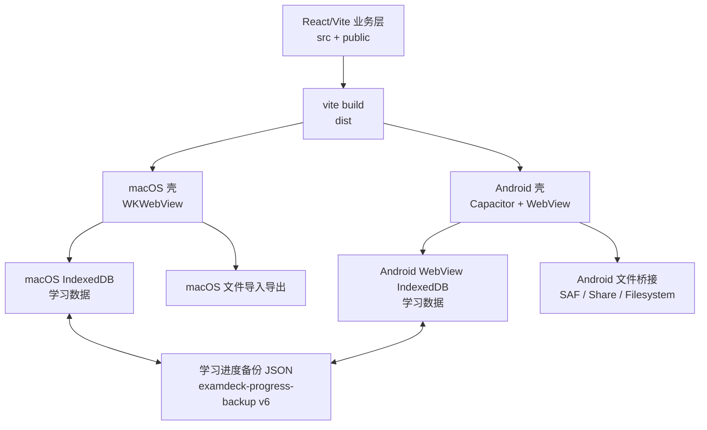

# 塔里木刷题王 Android 版架构设计

## 1. 设计结论

Android 版第一阶段不建议用 Kotlin / Jetpack Compose 完全重写。推荐路线是：

```text
React/Vite/TypeScript 业务核心
        ↓
Capacitor Android 壳
        ↓
Android WebView + 原生文件桥接
```

原因：

- 现有 mac 版的刷题业务、题库规则、每日复习、错题、收藏、已斩、重难题、模拟考试、学习计划都已经在 `src/` 里实现。
- 如果 Android 版重写一套业务，后续会出现两套规则：mac 修了一个统计 bug，Android 也要再修一次。
- Capacitor 可以复用当前前端，重点只补 Android 文件导入导出、移动端布局和安装包。
- 用户要求“学习进度可以在不同版本之间手动导入导出”，复用现有备份协议是最稳的路线。

结论：Android 版应定位为“同一套塔里木刷题王应用的 Android 壳”，不是一个独立新软件。

## 2. 现有 mac 版基础

当前项目主体是 React + Vite + TypeScript：

- 入口：`src/App.tsx`
- 业务规则：`src/lib/appRules.ts`
- 存储：`src/lib/storage.ts`
- 图片存储：`src/lib/imageStore.ts`
- Excel 导入：`src/lib/excelImport.ts`
- Excel 导出：`src/lib/excelExport.ts`
- 文件导出：`src/lib/fileExport.ts`
- 样式：`src/styles.css` + `src/styles/*.css`

当前数据特点：

- 主数据保存在 IndexedDB。
- `localStorage` 只保留旧数据兼容、元信息和迁移标记。
- 学习进度导出为 JSON。
- 当前备份格式是 `kind: "examdeck-progress-backup"`，`version: 6`。
- 备份里包含 `data` 和 `images`，图片会跟随进度备份导出。

这些设计对 Android 版是有价值的，尤其是：

- Android 不应该直接复制 IndexedDB 文件。
- Android / mac 之间只通过学习进度文件迁移。
- 图片必须跟随备份，否则换设备后题目图片会丢失。

## 3. 产品目标

Android 版目标：

- Android 手机可安装运行。
- 单机离线使用，不需要登录，不依赖服务器。
- 支持内置题库。
- 支持用户导入 Excel 题库。
- 支持刷题、错题、收藏、已斩、重难题、每日复习、今日总结、模拟考试。
- 支持学习计划。
- 支持导出完整学习进度。
- 支持导入 mac 版导出的学习进度。
- 支持 Android 导出的学习进度再导入 mac 版。
- 支持题目图片跟随备份迁移。

不建议第一版做：

- 云同步。
- 登录系统。
- 在线题库市场。
- 多端自动同步。
- 复杂账号权限。

原因：当前产品明确是单机软件，手动导入导出更符合定位，也能降低隐私和维护成本。

## 4. 推荐技术栈

### 4.1 首选方案：Capacitor Android

建议使用：

- React
- Vite
- TypeScript
- Capacitor Android
- Android WebView
- Android Storage Access Framework 文件选择 / 保存
- Capacitor Filesystem / Share，必要时写自定义插件

当前 `package.json` 已经包含：

- `@capacitor/core`
- `@capacitor/app`
- `@capacitor/filesystem`
- `@capacitor/share`
- `@capacitor/cli`

但当前项目没有正式的 Android Capacitor 工程，需要新增：

```text
examdeck/
  android/
  capacitor.config.ts
  scripts/
    build-android-app.sh
```

### 4.2 备选方案

#### 纯 Kotlin / Jetpack Compose

不建议作为第一版。

优点：

- 原生体验最好。
- SQLite / Room / 文件系统控制最强。

缺点：

- 需要重写全部业务逻辑。
- 统计规则和 mac 版容易分叉。
- KaTeX / 富文本 / Excel 解析 / 图片导出都要重新处理。
- 开发周期明显变长。

#### React Native

也不建议当前阶段使用。

原因：

- 不能直接复用现有 DOM/CSS。
- KaTeX、Excel、IndexedDB、WebView 存储都要重新适配。
- 重构成本高于 Capacitor。

## 5. 总体架构



Android 原生层只负责：

1. 创建 WebView 并加载前端静态资源。
2. 提供文件选择能力。
3. 提供保存文件能力。
4. 提供分享文件能力。
5. 保持应用包名和本机数据目录稳定。
6. 打包、签名、升级。

业务层仍由 React 维护。

## 6. Android 项目结构

建议新增：

```text
examdeck/
  android/
    app/
      build.gradle
      src/main/
        AndroidManifest.xml
        java/.../MainActivity.kt
        res/
          mipmap-*/ic_launcher.*
          values/strings.xml
  capacitor.config.ts
  scripts/
    build-android-app.sh
    sign-android-release.sh
```

建议包名：

```text
com.tarim.examdeck
```

包名一旦发布后不要改。

原因：

- Android 用户数据跟包名绑定。
- 改包名等于安装另一个新 App，旧学习数据不会自动迁移。
- 即使用户手动导入导出可迁移，也会增加出错概率。

## 7. 加载策略

Capacitor 默认会把 `dist/` 打包进 Android assets，并通过本地 WebView 加载。

建议：

- Web 端继续 `npm run build` 输出 `dist/`。
- Android 构建前执行 `npx cap sync android`。
- Android WebView 只加载本地资源，不加载远程服务器。
- 生产版禁用远程调试。
- 外链不要直接在 App 内打开，必要时跳系统浏览器。

需要确认：

- KaTeX 字体在 Android WebView 中正常加载。
- `public/bootstrap/progress.json` 能从打包资源读取。
- `/question-images/...` 静态图片路径在 Android 里正常。
- `IndexedDB` 在 Android WebView 中持久化稳定。

## 8. 存储设计

### 8.1 第一版存储

第一版继续使用 IndexedDB。

优点：

- 最大程度复用 mac 版。
- 不需要重写存储层。
- 当前 `src/lib/storage.ts` 已经把静态数据和进度数据分开保存。

当前分层：

```text
静态数据：
- questions
- decks
- seedImported

进度数据：
- stats
- dailyStats
- notes
- favoriteQuestionIds
- slashedQuestionIds
- studyPlanDeckIds
- sessions
- activeSession
- practices
- dailyReviewSessions
- dailyReviewSession
- dailyMistakeSummary
- dailyReviewCompletion
```

注意：

- Android 版不能把用户学习数据写到 APK assets 中。
- assets 是只读的，升级时也会被替换。
- 用户数据必须存在 WebView 的持久化存储或原生私有目录。

### 8.2 第二版存储增强

当题库继续增大后，可以考虑：

- 静态题库放 SQLite / Room。
- 用户进度放 SQLite / Room。
- 图片放 App 私有文件目录。
- React 通过 Capacitor 插件读写数据。

但这属于第二阶段。第一版不要同时重构 UI、存储和 Android 壳，否则风险太高。

## 9. 跨平台学习进度导入导出

这是 Android 版最关键的设计。

### 9.1 兼容原则

mac / Android 之间只通过备份文件迁移，不直接复制本机数据库。

原因：

- mac 的 WKWebView IndexedDB 和 Android WebView IndexedDB 物理格式不同。
- 直接复制 IndexedDB 文件风险高。
- JSON 备份可以做版本号、校验、迁移和错误提示。

### 9.2 当前兼容格式

Android 第一版必须支持现有格式：

```json
{
  "app": "塔里木刷题王",
  "kind": "examdeck-progress-backup",
  "version": 6,
  "exportedAt": "2026-06-29T00:00:00.000Z",
  "data": {
    "questions": [],
    "decks": [],
    "stats": {},
    "dailyStats": {},
    "notes": {},
    "favoriteQuestionIds": [],
    "slashedQuestionIds": [],
    "studyPlanDeckIds": [],
    "sessions": [],
    "activeSession": null,
    "practices": {},
    "dailyReviewSessions": {},
    "dailyReviewSession": null,
    "dailyMistakeSummary": null,
    "dailyReviewCompletion": null,
    "seedImported": true
  },
  "images": []
}
```

Android 导入时不要强依赖 `app` 字段。

允许：

- `app: "塔里木刷题王"`
- 旧版本没有 `app`

真正应该识别的是：

- `kind: "examdeck-progress-backup"`
- 或者文件里直接有 `questions`、`decks` 的旧格式。

### 9.3 Android 导出策略

第一版继续导出 JSON。

建议文件名：

```text
塔里木刷题王-学习进度-YYYY-MM-DD-HH-mm-ss.json
```

导出内容：

- 完整题库。
- 完整学习记录。
- 收藏。
- 已斩。
- 重难题状态。
- 每日复习状态。
- 今日总结。
- 模拟考试记录。
- 题目笔记。
- 用户导入图片。

不建议只导出“纯进度”。

原因：

- 两台设备题库版本可能不一致。
- 纯进度依赖题目 ID 完全一致。
- 用户手动迁移时，完整备份最不容易出错。

### 9.4 Android 导入策略

导入流程：

```text
用户选择备份文件
→ 读取文件
→ 判断格式
→ JSON 解析
→ parseProgressBackup()
→ normalizeAppDataForCurrentRules()
→ extractProgressBackupImages()
→ importStoredQuestionImages()
→ 弹窗提示将覆盖当前本机数据
→ 写入 IndexedDB
→ 恢复未完成模拟考试 / 每日复习状态
→ 显示导入结果
```

导入前弹窗必须明确：

- 会覆盖当前手机本机题库。
- 会覆盖统计、错题、收藏、已斩、笔记、复习进度。
- 如果当前手机也刷过题，建议先导出一份本机备份。

建议导入弹窗按钮：

- `先导出本机备份`
- `继续覆盖导入`
- `取消`

第一版只做覆盖导入即可。

合并导入可以放到第二阶段。

### 9.5 未来备份格式

JSON + base64 图片简单，但题库和图片多了以后会变大。

第二阶段建议升级为 `.tarimbackup`：

```text
塔里木刷题王-学习进度-xxxx.tarimbackup
本质是 zip：
├─ manifest.json
├─ data.json
└─ images/
   ├─ img_001.png
   ├─ img_002.jpg
   └─ ...
```

优势：

- 不会生成超大的单个 JSON。
- 图片可以按文件存储。
- Android 分享和保存更稳定。
- 后续可以加校验和压缩。

但第一版不要急着换格式。第一版先保证兼容 mac 现有 JSON。

## 10. Android 文件能力设计

Android 最大差异是文件权限。

不要申请“管理所有文件”之类的大权限。

第一版应该使用 Android 系统文件选择和保存机制：

- 导入 JSON：系统文件选择器。
- 导入 Excel：系统文件选择器。
- 导出学习进度：系统创建文件。
- 导出题库：系统创建文件。
- 分享备份：Android 分享面板。

### 10.1 导入文件

需要支持：

- `.json`
- `.xlsx`
- 未来 `.tarimbackup`

读取方式：

```text
用户选择文件
→ Android 原生拿到 Uri
→ 读取为 ArrayBuffer / base64
→ 传给 Web 层
→ Web 层复用现有解析逻辑
```

不建议 WebView 直接依赖 `<input type="file">` 作为唯一方案。

原因：

- 不同 Android WebView 对文件选择行为有差异。
- 大文件导入时错误处理弱。
- 原生 Uri 读取能更好地处理权限和文件名。

### 10.2 导出文件

当前 `src/lib/fileExport.ts` 支持：

- mac：`window.webkit.messageHandlers.examdeckNativeSaveFile`
- 浏览器：`showSaveFilePicker`
- 普通浏览器：`a.download`

Android 版需要新增分支：

```ts
window.Capacitor?.isNativePlatform()
```

建议新增统一桥：

```ts
window.examdeckAndroidSaveFile({
  fileName,
  mimeType,
  base64
})
```

或者写 Capacitor 插件：

```text
ExamdeckFilePlugin.saveFile()
ExamdeckFilePlugin.openFile()
ExamdeckFilePlugin.shareFile()
```

导出策略：

- 小文件可以走一次性 base64。
- 大文件必须分片，复用当前 mac 保存文件的分片思路。
- 保存成功后显示 Android 系统提示或应用内提示。

## 11. 移动端 UI 设计

Android 不能照搬 mac 大屏布局。

### 11.1 首页

建议结构：

```text
顶部：
- App 名称
- 今日复习入口
- 设置入口

中部：
- 搜索题库
- 学习计划选择
- 已加入题库卡片

底部：
- 主页 / 复习 / 统计 / 设置
```

移动端不要使用左侧固定侧边栏。

建议改为：

- 底部导航。
- 或顶部汉堡菜单 + 底部主要操作。

### 11.2 刷题页

mac 版右侧题号面板在手机上不合适。

Android 建议：

```text
顶部：
- 返回
- 题库名
- 当前进度

中间：
- 题干
- 图片
- 选项
- 解析

底部固定：
- 上一题
- 下一题
- 收藏
- 已斩
- 重难

题号面板：
- 底部抽屉打开
```

### 11.3 每日复习

从题库进入每日复习时，直接进入答题页，这一点和你前面确定的 mac 逻辑保持一致。

Android 上需要重点优化：

- 复习队列为空时的提示。
- 当天完成后的提示。
- 中断恢复。

### 11.4 模拟考试

Android 模拟考试必须保持考试模式：

- 选完不立即显示对错。
- 不自动跳题。
- 交卷后统一显示成绩和答案。
- 未答题交卷前必须提示未答数量。
- 正在考试要持久化保存。

这些问题 mac 版前面已经修过，Android 版必须复用同一套规则。

### 11.5 题目编辑

第一版 Android 可以弱化编辑能力。

建议：

- 保留查看。
- 保留收藏、已斩、重难。
- 题目编辑入口可以先隐藏或放到二级菜单。

原因：

- 手机上编辑富文本、公式、图片路径体验差。
- 容易误操作。

## 12. 公式和富文本

当前使用 KaTeX。

Android 必测：

- 行内公式和中文基线。
- 长公式小屏换行。
- 题干公式。
- 选项公式。
- 解析公式。
- 判断题短文本中的公式。
- 深色模式下公式颜色。

之前 mac 版已经遇到公式上下偏移问题，Android WebView 字体渲染不同，不能默认通过。

建议：

- Android 先只做浅色模式。
- 公式容器不要强行 `inline-block`。
- 长公式允许横向滚动或自然换行。
- 每次改公式样式都要截图验证。

## 13. 性能设计

当前题库量已经不小，Android 手机性能弱于 Mac。

重点风险：

- 首次加载大 JSON 慢。
- IndexedDB 写入大对象卡顿。
- Excel 导入耗时。
- 图片 base64 备份过大。
- 题库首页卡片多时滚动卡顿。

第一版优化：

- 首页只显示学习计划题库。
- 题库列表虚拟滚动或分页。
- 错题 / 收藏 / 已斩列表必须分页或加载更多。
- Excel 导入显示进度。
- 导入失败不能污染现有数据。
- 大文件导出使用分片。

第二版优化：

- SQLite 化。
- 图片文件化。
- `.tarimbackup` zip 化。
- Web Worker 解析 Excel。

## 14. 权限和隐私

Android 版定位为单机软件。

默认不需要：

- 网络权限。
- 定位权限。
- 通讯录权限。
- 相机权限。
- 麦克风权限。
- 管理所有文件权限。

如果需要分享文件，可以通过系统分享面板，不需要自己上传。

隐私说明建议写清楚：

- 题库和学习进度只保存在本机。
- 不上传服务器。
- 不自动同步。
- 换设备需要手动导出/导入。
- 卸载 App 可能删除本机学习数据，卸载前应先导出备份。

## 15. 发布和安装

### 15.1 内部分发

少量用户可以发 APK。

需要注意：

- APK 必须签名。
- 用户需要允许安装未知来源应用。
- 包名不能变。
- 版本号必须递增。
- 每次发版保留一份 release 包。

### 15.2 正式分发

如果后续上应用商店或 Google Play，需要：

- AAB 打包。
- 正式签名证书。
- 隐私政策。
- 目标 SDK 和权限合规。
- 文件访问权限合规。

具体目标 SDK 和应用商店规则会变化，正式发布前按当时平台要求重新确认。

## 16. 版本号和数据迁移

建议版本分两套：

```text
应用版本：
- 1.0.0
- 1.0.1
- 1.1.0

数据协议版本：
- examdeck-progress-backup version 6
- 未来 schemaVersion 7
```

应用版本变化不一定改变数据协议。

数据协议变化必须提供迁移函数。

建议新增：

```text
src/lib/backup/
  parseBackup.ts
  migrateBackup.ts
  normalizeBackup.ts
  exportBackup.ts
  importBackup.ts
```

当前 `parseProgressBackup()` 仍然可用，但后续应该从 `appRules.ts` 中拆出来，避免业务规则文件继续膨胀。

## 17. 测试策略

### 17.1 业务规则测试

继续复用当前单元测试：

- 题库导入。
- 统计规则。
- 每日复习。
- 重难题。
- 已斩。
- 学习计划。
- 备份导入导出。

### 17.2 跨平台备份测试

必须建立固定测试用例：

```text
mac 导出 → Android 导入 → 校验题库数、题目数、图片数、统计、收藏、已斩
Android 导出 → mac 导入 → 校验同上
旧 version 6 导入 Android
未来 version 7 导入 mac
缺图片备份导入
损坏 JSON 导入
超大备份导入
```

### 17.3 Android 设备测试

至少测试：

- 一台小屏手机。
- 一台大屏手机。
- 一台国产 Android 系统。
- 一台平板或横屏。
- 低性能设备。

核心路径：

- 首次安装。
- 首次启动。
- 加入学习计划。
- 顺序刷题。
- 每日复习。
- 模拟考试。
- 收藏刷题。
- 导入 Excel。
- 导出学习进度。
- 导入 mac 备份。
- 升级覆盖安装。
- 卸载前导出提醒。

### 17.4 UI 截图验收

需要单独截图验收：

- 首页。
- 刷题页。
- 题号抽屉。
- 每日复习。
- 模拟考试。
- 设置导入导出。
- 公式题。
- 图片题。
- 长题干。
- 多选题。

## 18. 第一版实施计划

### 阶段 1：Android 壳跑起来

- 新增 `capacitor.config.ts`。
- 安装 `@capacitor/android`。
- `npx cap add android`。
- 配置应用名：`塔里木刷题王`。
- 配置包名：`com.tarim.examdeck`。
- `npm run build`。
- `npx cap sync android`。
- Android Studio 打开运行。

验收：

- Android 手机能打开首页。
- 内置题库能加载。
- IndexedDB 重启后数据不丢。

### 阶段 2：移动端 UI

- 去掉移动端左侧栏。
- 首页改移动端卡片。
- 刷题页改单列。
- 右侧题号面板改底部抽屉。
- 底部固定上一题 / 下一题。
- 设置页导入导出按钮适配触控。

验收：

- 单手可刷题。
- 长题干不遮挡按钮。
- 选项点击区域足够大。
- 横竖屏可用。

### 阶段 3：文件导入导出

- Android 文件选择器导入 JSON。
- Android 文件选择器导入 Excel。
- Android 保存学习进度 JSON。
- Android 分享学习进度 JSON。
- 导入前覆盖确认。
- 导出失败提示。

验收：

- mac 导出 JSON 可导入 Android。
- Android 导出 JSON 可导入 mac。
- 图片题跨平台不丢图。

### 阶段 4：安装包和升级

- Release APK 签名。
- 固定版本号。
- 覆盖安装测试。
- 导出备份后卸载测试。
- 写用户安装说明。

验收：

- 用户能安装。
- 覆盖升级不丢数据。
- 误卸载前有备份说明。

## 19. 主要风险

### 风险 1：Android WebView 存储被系统清理

缓解：

- 设置页显著提供“导出学习进度”。
- 重要操作前提醒备份。
- 后续可增加本地自动备份到 App 私有目录。

### 风险 2：大备份 JSON 导入卡顿

缓解：

- 第一版限制提示。
- 导入时显示加载状态。
- 第二版升级 `.tarimbackup` zip 格式。

### 风险 3：图片迁移失败

缓解：

- 导入后统计图片恢复数量。
- 备份必须包含 `images`。
- 导入失败时不覆盖现有数据。

### 风险 4：移动端公式显示异常

缓解：

- 建立公式题测试集。
- 每次改公式样式都在 Android 真机截图。

### 风险 5：同一功能两端表现不一致

缓解：

- 业务规则必须保留在 TypeScript 共享层。
- Android 不重写答题统计。
- Android 只做壳和文件能力。

## 20. 推荐验收标准

Android 第一版可以发布给用户前，至少满足：

- 安装包可在目标 Android 手机正常安装。
- 无网络也能完整使用。
- 内置题库可用。
- 刷题、错题、收藏、已斩、重难题、每日复习、模拟考试可用。
- 退出 App 再打开，学习进度不丢。
- Android 导出学习进度成功。
- mac 导出的学习进度可以导入 Android。
- Android 导出的学习进度可以导入 mac。
- 图片题导入导出后图片正常。
- 覆盖升级不丢数据。
- 卸载前用户知道需要导出备份。

## 21. 最终建议

Android 版不要做成“另一个软件”，而应做成“同一套塔里木刷题王的 Android 外壳”。

第一版的核心任务不是重写功能，而是：

1. 把现有 React 应用稳定跑在 Android WebView 中。
2. 把手机端布局调整到可用。
3. 把 Android 文件导入导出做扎实。
4. 保证 mac / Android 学习进度双向导入导出。

只要备份格式稳定，Android 版就可以保持单机定位，同时让用户在不同设备之间手动迁移学习进度。
