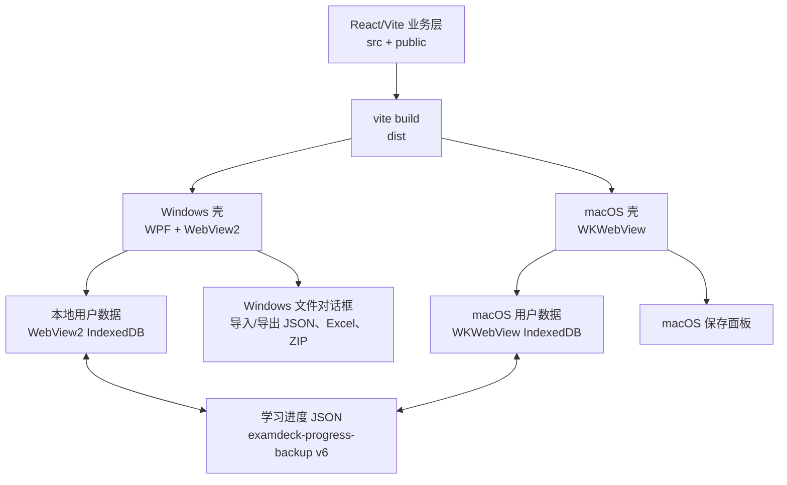

# 塔里木刷题王 Windows 版架构设计

## 1. 现有 mac 版判断

当前 `examdeck` 项目主体是 React + Vite + TypeScript 前端应用，mac 版只是一个很薄的原生壳：

- `macos/TarimExamdeckApp.swift` 使用 `WKWebView` 承载 `dist/index.html`。
- `examdeck://app/index.html` 自定义协议负责加载打包后的静态资源。
- 前端主存储使用 IndexedDB，`localStorage` 只保留元信息和迁移标记。
- 学习进度导出为 JSON，格式为 `kind: "examdeck-progress-backup"`，当前代码生成 `version: 6`。
- 题目图片通过 `images` 字段跟随进度备份导出，避免跨设备丢图。

结论：Windows 版不应重写刷题业务，应复用现有 `src/`、`public/`、`dist/`，只新增 Windows 桌面壳、安装包和少量原生文件能力适配。

## 2. 产品定位

Windows 版继续使用“塔里木刷题王”这个名称，内部数据协议继续沿用 `examdeck`，避免破坏已有学习进度文件。

目标能力：

- Windows 10/11 可安装运行。
- 离线使用，题库和学习记录保存在本机。
- 支持从 mac 版导出的学习进度 JSON 手动导入。
- 支持导出 Windows 版学习进度 JSON，再导入 mac 版。
- 支持 Excel 题库导入、题库导出、进度备份、大文件保存对话框。
- 保持当前题库、错题、收藏、划掉题、每日复习、练习会话等数据含义不变。

## 3. 推荐技术方案

推荐：`.NET 8 WPF + WebView2`。

原因：

- 与现有 mac 壳模式最接近：原生窗口 + WebView 承载 Vite 静态应用。
- Windows 兼容性和企业环境接受度高。
- WebView2 基于 Edge，IndexedDB、File API、Blob、KaTeX、JSZip 支持完整。
- 原生保存/打开文件对话框好做，适合中文桌面软件。
- 打包可以使用 MSIX 或单文件安装器，后续签名也清晰。

备选：

- Electron：开发最快，但安装包体积大，资源占用高。
- Tauri：体积小，但 Windows 文件对话框和 WebView 行为需要额外验证，团队没有 Rust 经验时不建议首选。
- 纯 WPF/WinUI 重写：不建议，成本高且容易造成 mac/Windows 功能分叉。

## 4. 总体架构



Windows 版只负责四件事：

1. 创建主窗口并加载 `dist/index.html`。
2. 提供静态资源访问路径。
3. 提供原生保存文件能力，替代 mac 的 `webkit.messageHandlers.examdeckNativeSaveFile`。
4. 打包安装和版本更新。

业务逻辑继续在 React 里维护。

## 5. Windows 项目结构

建议新增：

```text
examdeck/
  windows/
    TarimExamdeck.Windows.csproj
    App.xaml
    App.xaml.cs
    MainWindow.xaml
    MainWindow.xaml.cs
    NativeBridge.cs
    app.manifest
    Assets/
      AppIcon.ico
  scripts/
    build-windows-app.ps1
```

发布产物：

```text
examdeck/release/windows/
  塔里木刷题王.exe
  塔里木刷题王-setup.exe
  dist/
```

## 6. WebView2 加载策略

优先使用虚拟主机映射：

- 将 `dist/` 映射到 `https://app.examdeck.local/`
- WebView2 加载 `https://app.examdeck.local/index.html`

这样比 `file://` 更稳：

- IndexedDB 行为更接近真实站点。
- 资源相对路径、字体、图片、JSON 加载更稳定。
- 后续可以限制外链打开方式。

Windows 壳应设置：

- 窗口标题：`塔里木刷题王`
- 初始尺寸：`1440 x 920`
- 最小尺寸：`1100 x 720`
- 用户数据目录：`%APPDATA%\TarimExamdeck\WebView2`

注意：用户数据目录一旦变化，IndexedDB 就会变成新的空数据。因此版本升级必须保持目录不变。

## 7. 原生保存桥接

现有前端 `src/lib/fileExport.ts` 已经抽象出保存入口：

1. mac 桌面版：`window.webkit.messageHandlers.examdeckNativeSaveFile`
2. 支持 File System Access API 的浏览器：`window.showSaveFilePicker`
3. 普通浏览器：`a.download`

Windows 版应增加同等能力，建议前端新增一个桥接分支：

```ts
window.chrome?.webview?.postMessage({
  channel: "examdeckNativeSaveFile",
  type: "start" | "chunk" | "finish",
  request
});
```

Windows 原生侧监听 WebView2 `WebMessageReceived`，复用 mac 版的分片协议：

- `start`：创建保存会话。
- `chunk`：接收 base64 分片。
- `finish`：弹出 `SaveFileDialog`，按用户选择写入文件。
- 完成后调用 `window.dispatchEvent(new CustomEvent("examdeck-save-file-result", ...))` 通知前端。

这样 `exportData()`、Excel 导出、ZIP 导出都能走同一套保存逻辑。

## 8. 学习进度跨版本兼容设计

### 8.1 兼容原则

学习进度跨 mac/Windows 手动迁移，只认导出的 JSON 文件，不直接复制 IndexedDB。

原因：

- mac `WKWebView` 与 Windows `WebView2` 的 IndexedDB 物理路径和内部格式不同。
- 直接拷贝浏览器存储有损坏风险，也不利于后续升级。
- JSON 可以做版本号、校验、迁移和错误提示。

### 8.2 进度文件格式

当前应继续支持：

```json
{
  "app": "塔里木刷题王",
  "kind": "examdeck-progress-backup",
  "version": 6,
  "exportedAt": "2026-06-25T15:09:27.127Z",
  "data": {
    "questions": [],
    "decks": [],
    "stats": {},
    "dailyStats": {},
    "notes": {},
    "favoriteQuestionIds": [],
    "slashedQuestionIds": [],
    "studyPlanDeckIds": [],
    "sessions": [],
    "activeSession": null,
    "practices": {},
    "dailyReviewSessions": {},
    "dailyReviewSession": null,
    "dailyMistakeSummary": null,
    "dailyReviewCompletion": null,
    "seedImported": true
  },
  "images": []
}
```

Windows 版继续使用“塔里木刷题王”，不要修改 `kind`、IndexedDB key 和数据协议名。导入时可兼容历史文件的 `app` 文案，但协议判断应以 `kind: "examdeck-progress-backup"` 为准。

### 8.3 导出策略

导出按钮行为：

- 文件名：`塔里木刷题王-学习进度-YYYY-MM-DD-HH-mm-ss.json`
- `kind`：继续为 `examdeck-progress-backup`
- `version`：继续为当前最高版本，短期保持 `6`
- `data`：完整 `AppData`
- `images`：只导出题目引用到的 IndexedDB 图片

不建议只导出“纯进度不含题库”，因为跨设备时题库版本可能不一致，会导致题目 id 对不上。

### 8.4 导入策略

导入时分三层处理：

1. 解析 JSON，检查 `kind` 或旧格式。
2. 调用现有 `parseProgressBackup(raw)` 得到 `AppData`。
3. 调用现有图片导入逻辑 `extractProgressBackupImages(raw)` + `importStoredQuestionImages(images)`。
4. 保存到 IndexedDB。

导入冲突策略建议提供两个按钮：

- `覆盖当前学习数据`：用于从 mac 迁移到 Windows，最容易理解。
- `合并到当前数据`：用于两个设备都刷过题时使用，内部走 `mergeBootstrapDataWithCurrentProgress`/题目 import key 迁移逻辑。

第一版可以只做“覆盖导入”，但必须在界面明确提示会替换当前本机学习记录。

### 8.5 版本迁移

导入函数要支持：

- 旧版直接 `AppData` JSON。
- `kind: examdeck-progress-backup` 的封装 JSON。
- `version <= 6` 的历史文件。

未来升级时新增：

```ts
function migrateProgressBackup(payload: unknown): AppData {
  // v1-v6 逐级补字段、改字段、修题库名
}
```

不要在 Windows 侧单独维护一份迁移逻辑，应放在 `src/lib/appRules.ts` 或 `src/lib/storage.ts`，由 mac 和 Windows 共用。

## 9. 本地存储设计

WebView2 内仍使用 IndexedDB：

- 数据库：`examdeck-storage`
- 对象仓库：`records`
- 静态题库 key：`examdeck:v4:static`
- 学习进度 key：`examdeck:v4:progress`

图片存储继续使用现有 `imageStore.ts` 的 IndexedDB。

Windows 原生侧不直接读写这些数据，避免出现两套数据写入路径。唯一例外是以后做“自动备份”时，可通过前端 JS 触发导出，不要直接扫 IndexedDB 文件。

## 10. 安装与发布

建议第一阶段发布为普通安装包：

- 目标：Windows 10 22H2 及以上、Windows 11。
- 依赖：WebView2 Runtime。安装器检测缺失时引导安装。
- 安装路径：`%LOCALAPPDATA%\Programs\TarimExamdeck`
- 用户数据：`%APPDATA%\TarimExamdeck`
- 快捷方式：桌面 + 开始菜单。

构建命令建议：

```powershell
npm run build
dotnet publish .\windows\TarimExamdeck.Windows.csproj -c Release -r win-x64 --self-contained false
```

如果目标电脑可能没有 .NET Runtime，可以改为 `--self-contained true`，安装包会更大但更稳。

## 11. 测试清单

跨平台进度必须做这些用例：

- mac 导出 JSON，Windows 覆盖导入，题库数量一致。
- Windows 导出 JSON，mac 覆盖导入，题库数量一致。
- 错题统计 `stats` 正确保留。
- 每日统计 `dailyStats` 正确保留。
- 收藏 `favoriteQuestionIds` 正确保留。
- 划掉题 `slashedQuestionIds` 正确保留。
- 练习进度 `practices` 正确保留。
- 未完成考试 `activeSession` 正确恢复。
- 带图片题导入后图片能显示。
- 大进度文件导出不会卡死或损坏。
- 新装 Windows 首次打开会加载内置 `public/bootstrap/progress.json`。
- 升级安装后 IndexedDB 数据不丢失。

## 12. 实施路线

第一阶段：Windows 壳最小可用版

- 新增 WPF + WebView2 项目。
- 加载 Vite `dist`。
- 设置固定 WebView2 用户数据目录。
- 支持外链用系统浏览器打开。
- 支持中文标题、图标、窗口尺寸。

第二阶段：文件能力兼容

- 在 `fileExport.ts` 增加 WebView2 保存桥接。
- Windows 侧实现分片保存协议。
- 验证进度 JSON、Excel、ZIP 三类导出。

第三阶段：导入导出体验

- 界面文案保持“塔里木刷题王”，避免 mac/Windows 两端名称不一致。
- 导入页明确显示“可导入 mac/Windows 学习进度 JSON”。
- 增加导入前摘要：题库数、题目数、已练题数、导出时间。
- 覆盖导入前自动导出一份本机备份。

第四阶段：安装包和验收

- 构建 `win-x64` 安装包。
- 检测 WebView2 Runtime。
- 在干净 Windows 10/11 虚拟机测试。
- 使用真实 mac 导出的 `塔里木刷题王-学习进度-2026-06-25-15-09-27.json` 做迁移验收。

## 13. 关键风险

- WebView2 用户数据目录变化会导致用户以为“数据丢了”，必须固定目录。
- 产品显示名、安装目录名和协议名要分层管理，不要因为 Windows 打包而修改 `kind`、IndexedDB key、数据协议名。
- 如果题库重新导入导致 question id 变化，需要依赖 `uid + type` 的 import key 做进度迁移。
- 图片题必须随进度 JSON 的 `images` 一起迁移，否则跨设备会丢图。
- Windows 路径和中文文件名要全链路测试，尤其是保存对话框和安装路径。

## 14. 架构结论

Windows 版应定位为“同一套 ExamDeck 应用的 Windows 原生壳”，而不是新开发一个独立软件。这样可以最大程度复用现有 mac 版本，保证题库、学习算法、导入导出和进度文件完全一致。

最重要的技术约束是：跨平台同步只通过 `examdeck-progress-backup` JSON 完成，mac 和 Windows 都只实现“导入/导出这个协议”，不互相读取对方的本地数据库。
